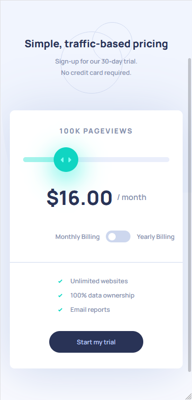
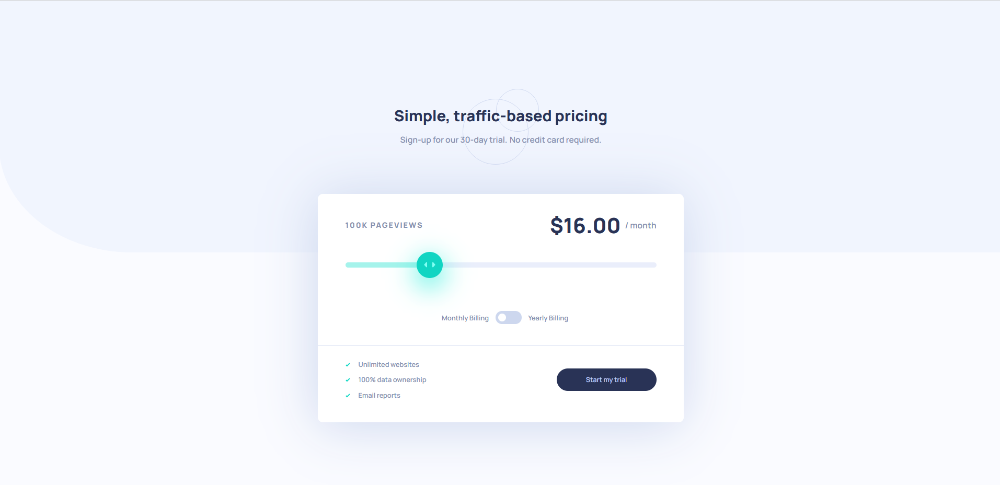

# Frontend Mentor - Interactive pricing component solution

This is a solution to the [Interactive pricing component challenge on Frontend Mentor](https://www.frontendmentor.io/challenges/interactive-pricing-component-t0m8PIyY8).


## Table of contents

  - [Overview](#overview)
  - [The challenge](#the-challenge)
  - [Screenshot](#screenshot)
  - [Links](#links)
  - [My process](#my-process)
  - [Built with](#built-with)
  - [What I learned](#what-i-learned)
  - [Continued development](#continued-development)
  - [Useful resources](#useful-resources)
  - [Author](#author)


## Overview

The challenge is to build out this interactive pricing component and get it looking as close to the design as possible.

### The challenge

Users should be able to:

- View the optimal layout for the app depending on their device's screen size
- See hover states for all interactive elements on the page
- Use the slider and toggle to see prices for different page view numbers

### Screenshot





### Links

- Solution URL: [Github repository](https://github.com/Everezze/Interactive-Pricing-Component)
- Live Site URL: [Github Live Page](https://everezze.github.io/Interactive-Pricing-Component/)

## My process

HTML Structure first, wrote down in paper. Then CSS for styling and finally Javascript for interaction.
I really tried to not break the natural flow of CSS as it would take a lot more css for responsiveness.
One thing I failed a little bit is the html structure as I didn't think about how I could limit the content inside the card without cutting the 'line'(the border above the advantages and button section) that separates the card in 2, so in the middle of the developement I needed to add some divs here and there.

### Built with

- Semantic HTML5 markup
- CSS3 (starting to use custom properties)
- Flexbox
- Mobile-first workflow

### What I learned

```css
.proud-of-this-css {
   color: var(--text-color);
}
.card__slider::-moz-range-progress{}
.card__slider:hover::-moz-range-thumb{}
.card__slider:active::-moz-range-thumb{}
.card__slider::-moz-range-track{}
.card__slider::-webkit-slider-thumb{}
```
```js
//First time using these events so it was quite fun

proudOfThisFunc.addEventlistener('input',function(){});
proudOfThisFunc.addEventlistener('load',function(){});
proudOfThisFunc.addEventlistener('resize',function(){});
proudOfThisFunc.addEventlistener('mouseup',function(){});
proudOfThisFunc.addEventlistener('mousedown',function(){});


//I didnt even know that I could implement an "if" statement (here with the ternary operator format) in a switch case, it was useful in this case!
switch(parseFloat(slider.value)){
        case 8:
            toggleButton.classList.contains('active')? price.innerHTML=`$${prices[0]*12*(1-25/100)}`:price.innerHTML=`$${prices[0]}`;
            break;
}
```

### Continued development

I'm now really comfortable with flexbox but I'll still mainly use it for the layout, I consider re-learning grid (as I didn't practice much with it I forgot a lot about it) soon so I can mix both of these methods to create complex layouts.

Also I will try to scale layouts more with the help of rems and ems and play with it, in this project I did it with the header : the whole section increased in size when I set the parent font-size to a bigger number since the children have ems units for paddings,margins,font-size they grew proportionally.

I will also implement more custom properties as it can be handy to change only the value of the variable instead of changing elements property one by one.

### Useful resources

- [Basic styling of a slider](https://dev.to/_phzn/styling-range-sliders-with-css-4lgl) - This helped me for the basic styling of an input range as I didn't even know how to do it first.
## Author

- Website - [My github profile](https://github.com/Everezze)
- Frontend Mentor - [@Everezze](https://www.frontendmentor.io/profile/Everezze)